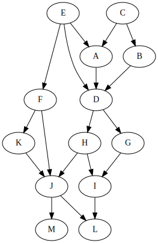

There is a program 'tsort' from coreutils package. I've met it before but
never read its info page. There is a section about the tool history.

> ‘tsort’ exists because very early versions of the Unix linker processed an
> archive file exactly once, and in order.  As ‘ld’ read each object in the
> archive, it decided whether it was needed in the program based on whether it
> defined any symbols which were undefined at that point in the link.

> The way to address this problem was to first generate a set of dependencies
> of one object file on another.  This was done by a shell script called
> ‘lorder’.

> Then you ran ‘tsort’ over the ‘lorder’ output, and you used the resulting
> sort to define the order in which you added objects to the archive.

I've checked coreutils 'tsort' and OpenBSD 'tsort' source code both are quite
sophisticated. Here is lite 'tsort' awk implementation. It works the same way
as the original tool.

It takes a list of pairs of node names representing directed arcs in a graph
and prints the nodes in topological order on standard output. Cycles are
treated as errors. It implements two algos for topological sort DFS and Kahn,
Kahn is default.


```
$ ./tsort.awk < graph
```

Use DFS instead of Kahn:

```
$ DFS= ./tsort.awk < graph
```

Show internal vertex representation:

```
$ SHOW= ./tsort.awk < graph
```

Generate svg image for the graph (need dot from graphviz):

```
$ ./graph2svg.sh graph graph.svg
```




